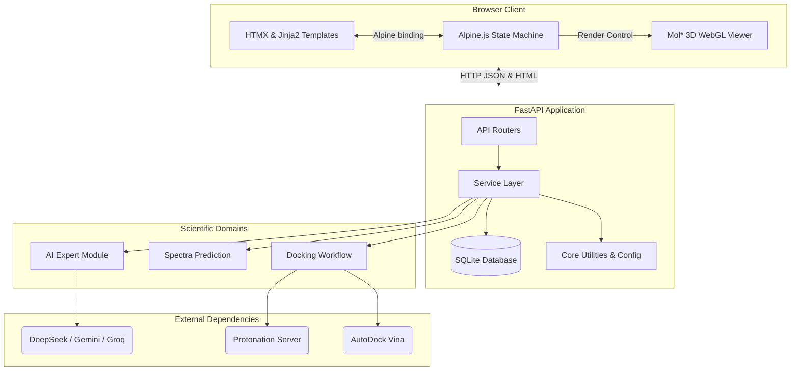

# Current Architecture

## High-Level System Architecture

Chemistry Companion is built on a modular, decoupled architecture leveraging lightweight, modern web technologies and robust Python scientific libraries.

## Key Architectural Principles
1. **Thick Client / Thin Server (Partially)**: While HTMX allows for server-rendered HTML for standard pages, complex workspaces (like Docking) use Alpine.js for thick-client reactivity without a build step.
2. **Service Layer Isolation**: API Routers never call scientific logic directly. They delegate to the `services/` layer, which orchestrates workflows and handles database persistence.
3. **Graceful Degradation**: If an AI provider fails, the `provider_manager` automatically falls back to the next available provider. If a dependency (like OpenBabel) is missing, core features try to degrade gracefully rather than crash the whole app.
