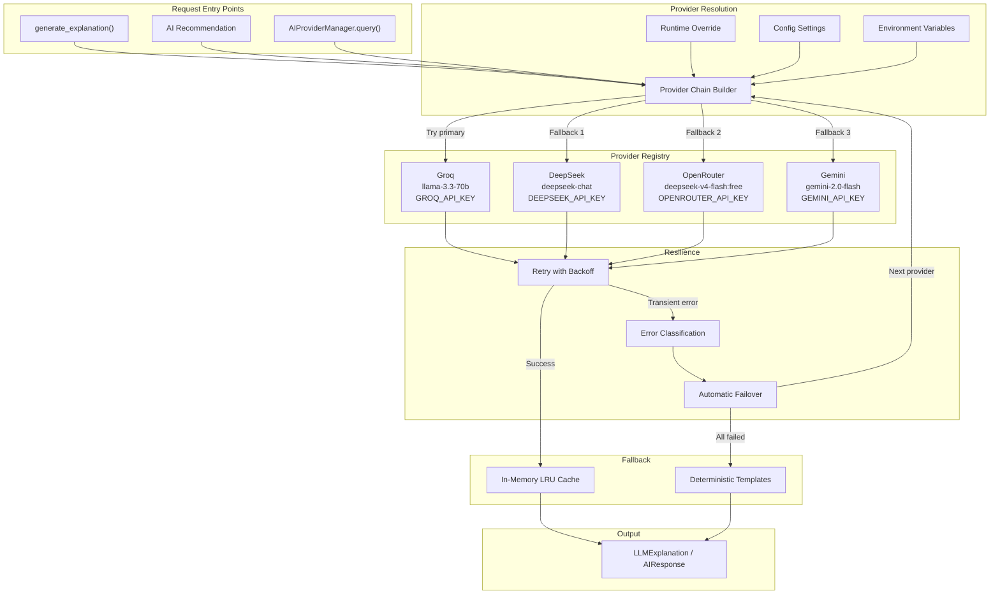
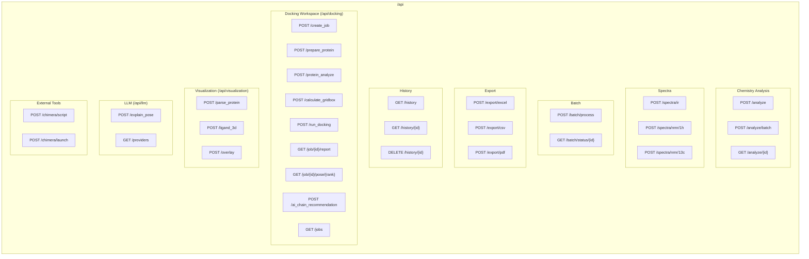

# System Architecture Overview

> Chemistry Companion — Computational Chemistry & Molecular Docking Platform

## High-Level System Architecture

```mermaid
graph TB
    subgraph "Frontend (Browser)"
        UI["Alpine.js + HTMX UI"]
        VIEWER["3Dmol.js Viewer"]
        TEMPLATES["Jinja2 Templates"]
    end

    subgraph "API Layer (FastAPI)"
        APP["api/app.py"]
        subgraph "Route Groups"
            R_ANALYSIS["analysis.py"]
            R_SPECTRA["spectra.py"]
            R_BATCH["batch.py"]
            R_EXPORT["export.py"]
            R_HISTORY["history.py"]
            R_STRUCTURE["structure.py"]
            R_DOCKING["docking.py"]
            R_DOCK_WS["docking_workspace.py"]
            R_VIZ["visualization.py"]
            R_LLM["llm_explanation.py"]
            R_VALID["validation.py"]
            R_BENCH["benchmarks.py"]
            R_EXT["external_tools.py"]
        end
    end

    subgraph "Service Layer"
        S_ANALYSIS["AnalysisService"]
        S_BATCH["BatchService"]
        S_EXPORT["ExportService"]
        S_HISTORY["HistoryService"]
        S_SPECTRA["SpectraService"]
        S_DOCK["DockingWorkspaceService"]
        S_VIZ["VisualizationService"]
        S_LLM["LLMService (legacy)"]
        S_AI["AIProviderManager (new)"]
    end

    subgraph "Core Engine"
        C_MOL["molecule_utils.py"]
        C_DESC["descriptor_utils.py"]
        C_VIZ["visualization_utils.py"]
        C_DATA["dataset_utils.py"]
        C_CONFIG["config.py"]
        C_LLM["llm_utils.py"]
        C_LOG["logging_utils.py"]
        C_OB["openbabel_utils.py"]
        C_PIPE["pipeline.py"]
        C_RESOLVE["resolver.py"]
    end

    subgraph "Docking Workflow"
        D_PREP["protein_preparation.py"]
        D_ANALYSIS["protein_analysis.py"]
        D_GRID["gridbox_builder.py"]
        D_VINA["vina_runner.py"]
        D_POSE["pose_manager.py"]
        D_INTER["interaction_analyzer.py"]
        D_POCKET["pocket_detection.py"]
        D_WATER["water_analysis.py"]
        D_PROTO["protonation.py"]
        D_QUALITY["quality_scorer.py"]
        D_CHIMERA["chimera_exporter.py"]
    end

    subgraph "Spectra Engine"
        SP_IR["ir_predictor.py"]
        SP_1H["proton_nmr.py"]
        SP_13C["carbon_nmr.py"]
    end

    subgraph "Data Layer"
        DB["SQLite (SQLAlchemy)"]
        FS["File System (outputs/)"]
    end

    subgraph "External Services"
        EXT_GROQ["Groq API"]
        EXT_DS["DeepSeek API"]
        EXT_OR["OpenRouter API"]
        EXT_GEM["Gemini API"]
        EXT_VINA["AutoDock Vina"]
        EXT_OB["OpenBabel"]
        EXT_CHIMERA["ChimeraX"]
        EXT_FPOCKET["fpocket"]
    end

    UI --> APP
    APP --> R_ANALYSIS & R_SPECTRA & R_BATCH & R_EXPORT & R_HISTORY
    APP --> R_DOCKING & R_DOCK_WS & R_VIZ & R_LLM & R_VALID & R_BENCH & R_EXT & R_STRUCTURE

    R_ANALYSIS --> S_ANALYSIS
    R_BATCH --> S_BATCH
    R_EXPORT --> S_EXPORT
    R_HISTORY --> S_HISTORY
    R_SPECTRA --> S_SPECTRA
    R_DOCK_WS --> S_DOCK
    R_VIZ --> S_VIZ
    R_LLM --> S_LLM

    S_ANALYSIS --> C_PIPE --> C_MOL & C_DESC & C_VIZ
    S_BATCH --> C_DATA
    S_SPECTRA --> SP_IR & SP_1H & SP_13C
    S_DOCK --> D_PREP & D_ANALYSIS & D_VINA & D_POSE & D_INTER
    S_DOCK --> D_POCKET & D_WATER & D_PROTO & D_QUALITY & D_CHIMERA
    S_LLM --> C_LLM
    S_AI --> C_LLM

    C_LLM --> EXT_GROQ & EXT_DS & EXT_OR & EXT_GEM
    D_VINA --> EXT_VINA
    D_PREP --> EXT_OB
    D_CHIMERA --> EXT_CHIMERA
    D_POCKET --> EXT_FPOCKET

    S_HISTORY --> DB
    S_DOCK --> DB & FS
```



---

## Molecular Docking Pipeline

```mermaid
flowchart LR
    subgraph "Step 1: Protein Upload"
        UPLOAD["PDB File Upload"]
        ANALYZE["Protein Analysis"]
        CHAIN["Chain Selection"]
        AI_CHAIN["AI Chain Recommendation"]
    end

    subgraph "Step 2: Receptor Preparation"
        WATER["Water Classification"]
        COFACTOR["Cofactor/Metal Handling"]
        PROTO["Protonation (optional)"]
        PREP["OpenBabel → PDBQT"]
        CLEAN["Rigid Receptor Cleaning"]
    end

    subgraph "Step 3: Binding Site"
        LIGAND_SITE["Ligand-based Detection"]
        POCKET["fpocket Detection"]
        MANUAL["Manual Grid Box"]
        GRIDBOX["Grid Box Config"]
    end

    subgraph "Step 4: Docking"
        LIG_PREP["Ligand PDBQT Prep"]
        VINA["AutoDock Vina"]
        PARSE["Pose Parsing"]
    end

    subgraph "Step 5: Analysis"
        INTER["Interaction Analysis"]
        REPORT["Report Generation"]
        CHIMERA["ChimeraX Export"]
        LLM_EXPLAIN["LLM Explanation"]
        DB_SAVE["Save to Database"]
    end

    UPLOAD --> ANALYZE --> CHAIN
    CHAIN --> AI_CHAIN
    CHAIN --> WATER & COFACTOR
    WATER & COFACTOR --> PROTO --> PREP --> CLEAN
    CLEAN --> LIGAND_SITE & POCKET & MANUAL
    LIGAND_SITE & POCKET & MANUAL --> GRIDBOX
    GRIDBOX --> LIG_PREP --> VINA --> PARSE
    PARSE --> INTER --> REPORT
    REPORT --> CHIMERA & LLM_EXPLAIN & DB_SAVE
```



---

## AI / LLM Provider Chain



---

## API Route Structure



---

## Key Design Patterns

### Optional Dependency Guards
All heavy dependencies (Vina, OpenBabel, Meeko, gemmi) are guarded:
```python
HAS_DOCKING = False
try:
    from .protein_preparation import prepare_protein
    HAS_DOCKING = True
except ImportError:
    # Provide stub functions that raise RuntimeError
```

### Service Layer Pattern
Services encapsulate business logic and are called by API routes:
```
Route Handler → Service Method → Core/Workflow Module → External Tool
```

### LLM Multi-Layer Degradation
```
Layer 1: Primary LLM Provider (configurable)
Layer 2: Fallback Providers (ordered chain)
Layer 3: Deterministic Templates (zero API calls)
```

### File-Based Job Persistence
Docking jobs use filesystem workspaces with DB metadata:
```
outputs/docking_workspace/<job_id>/
├── protein.pdbqt
├── ligand.pdbqt
├── config.json
├── vina_out.pdbqt
├── vina.log
├── report.json
├── pose_1.sdf
├── pose_2.sdf
└── ...
```
