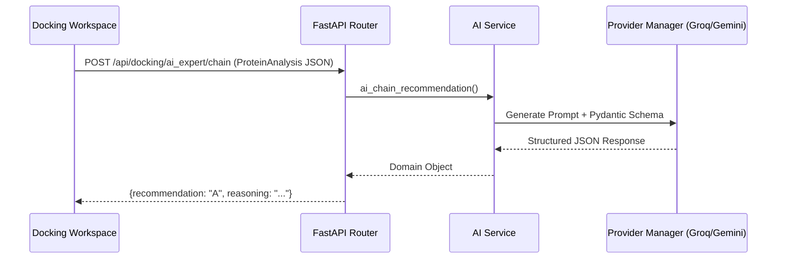

# AI System & Intelligence

The AI System in Chemistry Companion acts as a virtual structural biology expert. It assists users with preparing macromolecules, predicting spectra logic, and configuring docking experiments.

## Core Components

### 1. Provider Manager (`services/ai/provider_manager.py`)
Because LLM APIs are notorious for rate limits and outages, the `AIProviderManager` implements a **Fallback Chain**.
- **Registered Providers**: Groq, DeepSeek, OpenRouter, Gemini.
- **Mechanism**: When an AI request is triggered, it attempts the primary provider (e.g., Groq for speed). If it fails, it seamlessly falls back to the next provider in the chain (e.g., DeepSeek) until a valid response is received.

### 2. Recommendations Framework (`services/ai/recommendations.py`)
AI calls are not open-ended chat prompts. They are rigidly structured to return JSON configurations via Pydantic output parsers.
- **AI Chain Recommendation**: Analyzes multiple chains in a PDB file and recommends the best target chain for docking.
- **AI Water Classification**: Recommends which crystallographic waters to keep (catalytic) and which to strip (bulk).
- **Pocket Selection**: Evaluates FPocket outputs or ligand-bound sites and recommends the highest confidence binding pocket.

### 3. The Generative API Endpoints
Endpoints located in `api/routes/docking_workspace.py` (e.g., `/ai_expert/chain`) receive the full `ProteinAnalysis` dictionary from the backend and pass it as context to the LLM. 

## Future Extensibility
To add a new AI capability:
1. Define a Pydantic model in `services/ai/models.py`.
2. Write a prompt in `recommendations.py` combining standard biochemistry heuristic analysis with the specific question.
3. Use `ask_expert` to parse the output and enforce structure.
