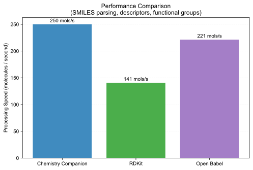
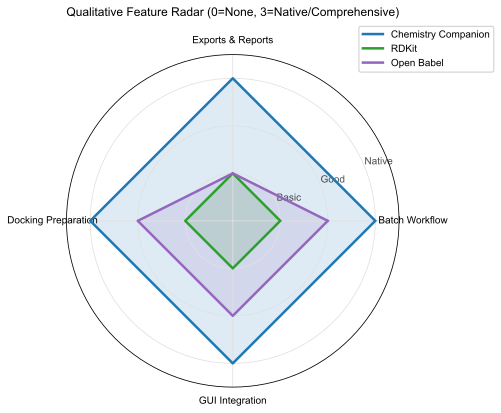
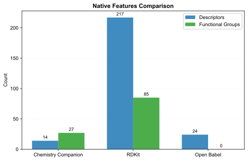

# Tool Comparison Benchmark

Comparing **Chemistry Companion**, **RDKit**, and **Open Babel**.

## Quantitative Metrics

| Tool                |   Speed (mols/sec) |   Descriptors (Native) |   Functional Group Classes |
|:--------------------|-------------------:|-----------------------:|---------------------------:|
| Chemistry Companion |              465.6 |                     14 |                         27 |
| RDKit               |              186.3 |                    217 |                         85 |
| Open Babel          |              643.3 |                     24 |                          0 |

## Qualitative Feature Matrix

> Score scale: `0` (None/External), `1` (Basic/Manual), `2` (Good), `3` (Native/Comprehensive)

| Feature             |   Chemistry Companion |   RDKit |   Open Babel |
|:--------------------|----------------------:|--------:|-------------:|
| Batch Workflow      |                     3 |       1 |            2 |
| Exports & Reports   |                     3 |       1 |            1 |
| Docking Preparation |                     3 |       1 |            2 |
| GUI Integration     |                     3 |       1 |            2 |

## Publication Plots

